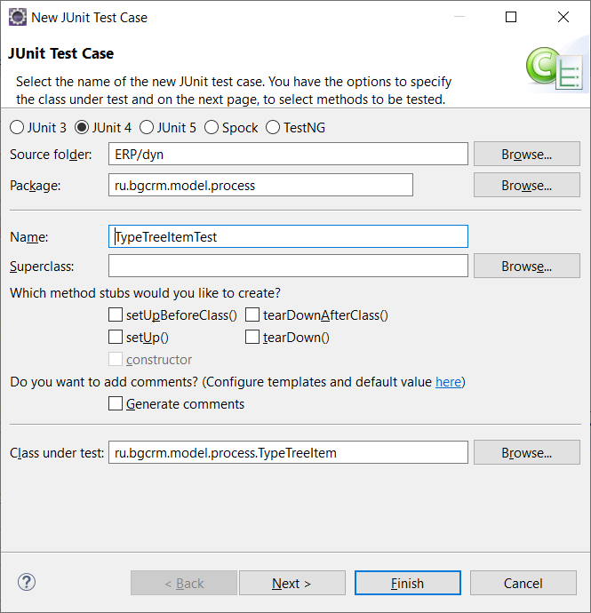

= IDE
:toc:

Опыт работы с различными IDE.

== VS Code
Реализована на JavaScript / TypeScript, платформа Electron.

=== Преимущества
[square]
* очень быстрая, потребляет сравнительно мало ресурсов;
* автоматическое определение симовлов отступов в файле и следование, формат;
* поддержка множества языков: Java Script распознаёт сложные конструкции, навигация, удобна для проектов с многими языками;
* удобный поиск операций по `Ctrl + Shift P` или файлов по `Ctrl + P`; 
* вся конфигурация хранится в файлах, вообще IDE всё видит как файлы и каталоги, без дополнительных понятий, можно спокойно работать с проектами в workspace от Eclipse, например; 
* открывать каталоги проектов можно как вместе в виде workspace, так и по отдельности;
* частые обновления с логами изменений, содержащими видеодемонстрации.

=== Недостатки
Инструменты работы с GIT: получить версию файла из другой ветки.;

* к концепции интерфейса, когда каждая операция в отдельном списке слева надо привыкать;
* по сравнению с Eclipse почти нет поддержки JSP;
* фукнции рефакторинга Java хуже, чем в Eclipse: при копировании кода не прихыватывает импорты;

==== Тесты
* нет аналога More Unit - быстрого создания классов

* TestNG вообще не запускается.

== Eclipse
=== Преимущества
[square]
* есть всё ""

== Методики работы
Хороший программист должен быть ленивым, поскольку лень - двигатель прогресса.
Если бы не лень, мы бы до сих пор

== Магия TDD
Сначала о плюсах. Быстро проверяется код, одна программа валидирует другую.

Иногда не сразу пишешь нужное тебе или заказчику, покрывать это тестами бессмысленно.

Много зависимостей, визуальный интерфейс, проще проверить глазами.

Идеально тестируются сложные алгоритмы с понятным входом-выходом.

Плохо, когда вход и выход - UI.

От скорости тестирования.

== Комментарии и чистый код
Не копировать - да.
Булиан параметр - нет, удобно.
Комментарии - иногда полезно сначала помечать мёртвый код, остаётся поиск по коду.
Нет пустых явадоков - да.
Сам себя описывающий код - нет, нужен уровень выше.

Лучше не именовать переменные вовсе, если позиция точно определяет роль.
result в функциях

Свой велосипед против "проверенного решения".
Стандартность logging API в длительной перспективе.
Свой враппер Log.getLog()
